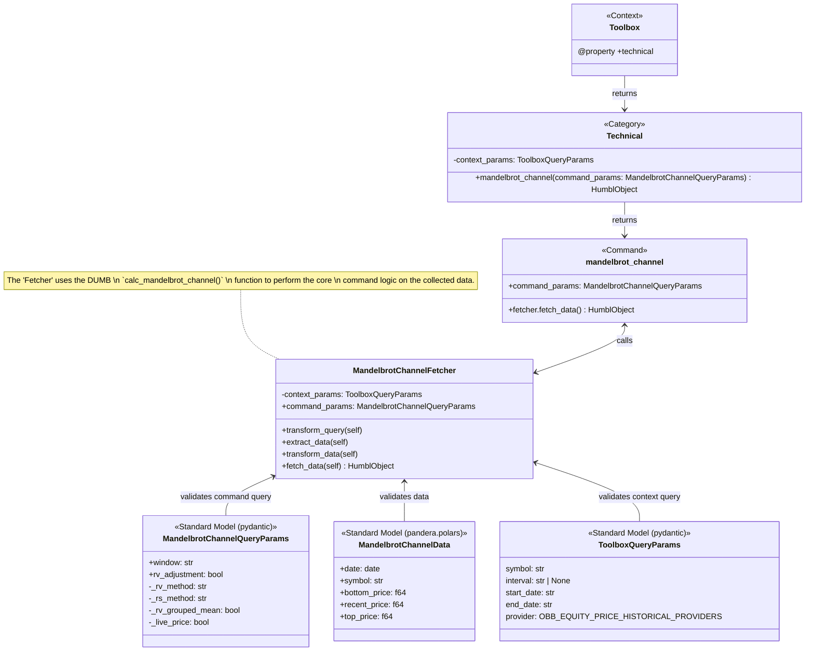

# **CCCC: core, context, category, command**

THe purpose of this design paradigm is to always be thinking of your application and features that you are implementing in a nested hierarchical structure. We do this for 3 main benefits, namely:

1. It is easy to tell where you should put your piece of code.
2. It is easy to create reusable functions for multiple use cases.
3. It is easy to diagram a flow chart of your application, given that you know where larger modules should go (core/context/category) and where endpoints of the graph (commands) should go.

The point of CCCC is to make creation of Models, View & Controllers simpler.The nested strucutre allows for easy mental organization.

!!! tip "CCCC Explained"

    ??? abstract "`Core`"
        The core of your app. Logic used in controllers goes here. This module is intended to contain sub-modules and functions that are not directly utilized from the package, but rather used in building the package itself.

        The core will hold the [standard_models](./standardization_framework.md), for all of the functions in the package.
        The core will also hold modules like the `utils` module, that is used in the humbldata package itself, and not publicly exposed.

    ??? abstract "`Context`"
        This is a grouping of multiple categories. The highest level of modules should go here.

        i.e `context` is a top-level directory that contains multiple `categories`. The `Toolbox` is an example of a context, becuase it contains `Technical`, `Quantitative` & `Fundamental` categories. This directory is at the same level as the `core` directory. This context holds all the `categories` that are used to build the `Toolbox`.

    ??? abstract "`Category`"
        This is the grouping of multiple commands that belongs to a context. Categories can be extended to as many <`sub-categories`> as needed.

    ??? abstract "`Command`"
        This is the smallest unit of code that can be executed.

## CCCC Framework
This is an example of how the CCCC framework can be used to create a simple API.
This showcases the `mandelbrot_channel` **command**, in the `Technical` **category** from the `Toolbox` **context**.

