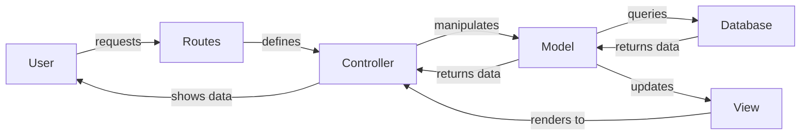

#  :simple-graphql: __M-V-C-DB__

## 🧠 Model
The Model represents the data structure and the business logic of the application. It directly manages the data and logic. A model can respond to requests for information, respond to instructions to change its state, and even notify observers in an event-driven system. This layer is where the core functionality of the application resides, dealing with the retrieval, insertion, update, and deletion of data. The model communicates with the database and processes the business logic based on the data received from the controller. It is completely independent of the user interface.

## 👀 View
The View is the user interface of the application. It is responsible for displaying the data that is received from the model. The view is completely independent of the model and the controller. It is only responsible for displaying the data and the user interface.

## 🎮 Controller
The Controller is the bridge between the User and the Model/View. It is responsible for processing the user's input and updating the model with the correct `QueryParams`. The controller is responsible for processing the user's input and updating the model. The controller is the only layer that interacts with the user. It receives the user's input and processes it. It then sends the processed data to the model for processing. The controller is responsible for updating the model based on the user's input and then sending the updated data to the view for display.

## 🗄️ Database
The Database is the storage of the application. It is responsible for storing the data that is received from the model. The database is completely independent of the model, view, and controller. It is only responsible for storing the data. The only interaction the database has is with the model, to store and retrieve data.

